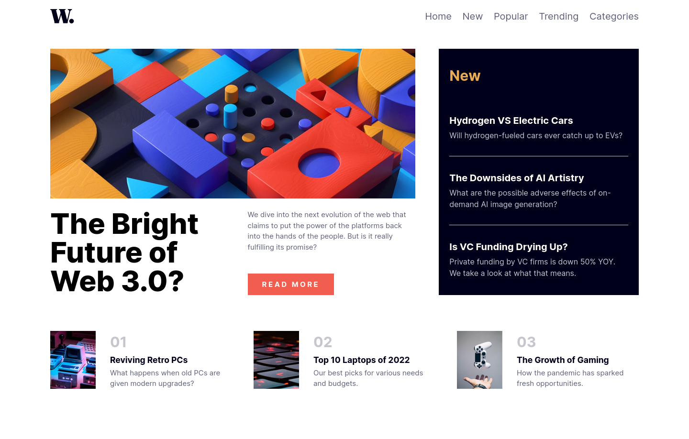

# Frontend Mentor - News homepage solution

This is a solution to the [News homepage challenge on Frontend Mentor](https://www.frontendmentor.io/challenges/news-homepage-H6SWTa1MFl). Frontend Mentor challenges help you improve your coding skills by building realistic projects. 

## Table of contents

- [Overview](#overview)
  - [The challenge](#the-challenge)
  - [Screenshot](#screenshot)
  - [Links](#links)
- [My process](#my-process)
  - [Built with](#built-with)
  - [Continued development](#continued-development)
- [Author](#author)

## Overview

### The challenge

Users should be able to:

- View the optimal layout for the interface depending on their device's screen size
- See hover and focus states for all interactive elements on the page

### Screenshot

### Links

- Solution URL: [Github Repo](https://github.com/jaheemprevost/news-homepage-main)
- Live Site URL: [Github Page](https://jaheemprevost.github.io/news-homepage-main/)

## My process

### Built with

- Semantic HTML5 markup
- CSS custom properties
- Flexbox
- CSS Grid
- Mobile-first workflow

### Continued development

I'm still not exactly used to laying out web pages with grid so
I would like to get better at doing so, as well as creating responsive, and accessible mobile navigation menus.

## Author

- Frontend Mentor - [@jaheemprevost](https://www.frontendmentor.io/profile/jaheemprevost)
- Twitter - [@JaheemPrevost](https://www.twitter.com/JaheemPrevost)
